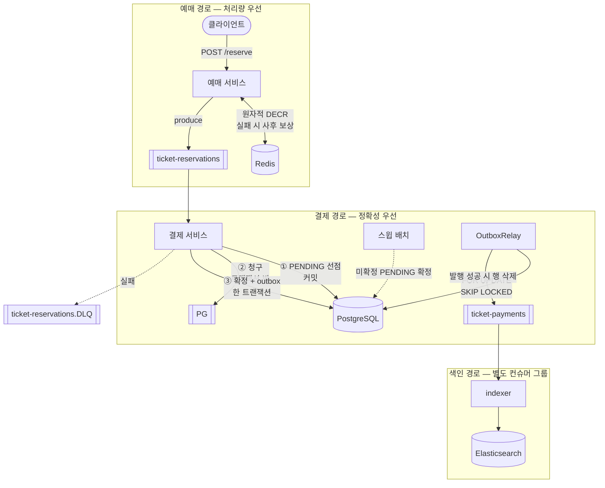

# Kafka 기반 티켓 예매 시스템

동시 예매 요청 환경에서 Kafka 를 다루며 마주친 문제를 **재현하고 해결하는 방식**으로 학습한 프로젝트입니다.
각 문제는 재현 → 원인 → 해결 순으로 Issue 에 기록했으며, 채택하지 않은 대안과 그 이유도 함께 남겼습니다.

**구성:** Spring Boot 2개 서비스(예매/결제) · Kafka 3 브로커 · Redis · PostgreSQL · Elasticsearch · Kubernetes + KEDA

## 다룬 문제

| | 내용 |
|---|---|
| [#1](../../issues/1) | 자동 생성된 토픽이 RF=1 로 고정되어, 브로커를 복구해도 ISR 에 합류하지 못하는 교착 |
| [#3](../../issues/3) | PG 연동 지연으로 발생한 컨슈머 리밸런싱과 중복 소비 |
| [#7](../../issues/7) | 결제 파이프라인의 Head-of-Line Blocking 해소와 DLQ 기반 에러 격리 |
| [#10](../../issues/10) | 오프셋 커밋 실패 시 결제 멱등성 보장과 재처리 검증 |
| [#12](../../issues/12) | 파티션 편중 제거와 Consumer Lag 기반 KEDA 오토스케일 |
| [#14](../../issues/14) | 다중 티켓 재고 관리와 DLQ 보상 트랜잭션 정합성 |
| [#16](../../issues/16) | Eager 리밸런싱의 소비 중단 제거 — Cooperative Sticky 전환과 그 대가 |
| [#17](../../issues/17) | **ack 후 발행 구간의 이벤트 유실 제거 — Transactional Outbox** |
| [#31](../../issues/31) | 로컬 인프라가 전부 휘발성 — 유실을 막으려 넣은 Outbox 의 저장소가 `emptyDir` 이던 모순 |
| [#32](../../issues/32) | **애플리케이션이 스키마를 바꾼다 — Flyway 도입과 `ddl-auto: validate`** |
| [#33](../../issues/33) | 옛 이미지가 조용히 계속 도는 문제 — `minikube image load` 는 같은 태그를 덮지 않는다 |

## 경로별로 다른 일관성 전략



예매 경로는 Redis 왕복 한 번으로 끝나고, 결제 경로는 ①②③ 3단계에 릴레이와 스윕까지 붙습니다.
**비싼 원자성이 어디에 붙어 있는지가 그림의 길이로 드러납니다.**

같은 저장소 안에서 두 경로의 보장 수준을 다르게 두었습니다.

| | 예매 | 결제 |
|---|---|---|
| 최우선 | 처리량 | 정확성 |
| 방식 | Redis 원자적 `DECR` + 사후 보상 | Transactional Outbox |
| 남는 위험 | 드물게 유령 재고 (정산 sweep 필요) | — |

**돈이 오가는 경로에만 비싼 원자성을 적용**했습니다.

## 검증

멱등성 · DLQ 분기 · Outbox 릴레이 발행은 Testcontainers 로 PostgreSQL·Kafka 를 띄워 통합 테스트로 확인합니다.

```bash
cd ticket-payment-service && ./gradlew test
```

### 측정한 수치

직접 측정한 값만 적었습니다. 측정 환경과 방법은 각 이슈에 있습니다.

| 항목 | 값 | 출처 |
|---|---|---|
| 파티션 분포 (4,132건) | 1,471 / 1,632 / 1,029 | [#12](../../issues/12) |
| KEDA 오토스케일 | 1 → 3 → 1 (lag 임계치 30) | [#12](../../issues/12) |
| Cooperative Sticky 합류 | 30초 (2라운드 × `max.poll.interval.ms` 15초) | [#16](../../issues/16) |
| 스케일 다운 반납 | 8.4초 (1라운드 — 떠나는 멤버는 즉시 반납) | [#16](../../issues/16) |
| 통합 테스트 | 12종 (Testcontainers: PostgreSQL + Kafka) | [#20](../../issues/20) · [#28](../../issues/28) |

합류가 **느려진** 것은 의도한 교환입니다. Eager 는 13초 만에 합류하지만 그 구간 전체 소비가 멈추고,
Cooperative 는 30초가 걸리는 대신 **리밸런싱 중에도 나머지 파티션이 계속 소비됩니다.**
이 30초는 줄일 수 없습니다 — `max.poll.interval.ms` 를 낮추면 PG 지연 허용치가 함께 낮아져
DLQ 유입이 늘어나기 때문입니다([#16](../../issues/16)).

**남은 한계**는 각 이슈에 미완료 항목으로 기록해 두었습니다.

한때 외부 결제 호출이 트랜잭션 안에 있어 "청구는 됐는데 기록은 실패"하는 멱등성 사각지대가 있었고, 이후 **PENDING 선점 → PG 청구 → 결과 확정의 2단계로 분리**해 해결했습니다([#21](../../issues/21)). 그 분리가 남기는 미확정 건은 **스윕 배치**가 확정합니다([#28](../../issues/28)). 재청구는 `orderId` 를 멱등키로 넘겨 막되, 실제 PG 멱등키에는 유효기간이 있으므로 **확정이 그 안에 끝나야 한다**는 운영 제약이 남습니다.

---

## 빠른 시작 (로컬 실행 순서)

로컬 minikube에서 **처음부터 끝까지** 따라 하는 순서입니다. 명령은 **저장소 루트**에서 실행합니다.

> **준비물:** Docker, `minikube`, `kubectl`, (KEDA 설치용) `helm`
> **폴더 구조:** 쿠버네티스 매니페스트는 `infra/`, 실행 스크립트는 `scripts/`, 각 서비스 소스와 `Dockerfile`은 `ticket-*-service/` 안에 있습니다.

### STEP 1. minikube 시작
넉넉한 리소스로 클러스터를 띄웁니다. (ES·Kibana·Kafka 3대까지 올라가므로 메모리를 크게 잡습니다)
```bash
minikube start --driver=docker --cpus=4 --memory=8192
```

### STEP 2. KEDA 설치 (최초 1회만)
Kafka lag 기반 오토스케일링에 필요합니다. 이미 설치돼 있으면 건너뜁니다.
```bash
helm repo add kedacore https://kedacore.github.io/charts
helm repo update
helm install keda kedacore/keda --namespace keda --create-namespace

# 설치 확인 (CRD 가 보이면 완료)
kubectl get crd scaledobjects.keda.sh
```

### STEP 3. 애플리케이션 이미지 빌드
`start-local.sh` 가 빌드까지 수행하므로 **평소에는 이 단계를 건너뛰어도 됩니다.** 수동으로 빌드한다면:

```bash
# minikube 안의 도커 데몬으로 전환한 뒤 빌드한다.
# 이 환경변수는 현재 셸에만 적용되며, `eval $(minikube docker-env -u)` 로 되돌린다.
eval $(minikube docker-env)

(cd ticket-reservation-service && docker build -t ticket-reservation-service:latest .)
(cd ticket-payment-service     && docker build -t ticket-payments-service:latest .)
```

> **`minikube image load` 를 쓰지 않는 이유:** load 는 **같은 태그면 이미지를 덮어쓰지 않습니다.**
> 실행 중인 컨테이너가 이미지를 잡고 있으면 `image rm` 도 실패합니다. 그래서 코드를 고쳐도
> 옛 이미지가 조용히 계속 도는 사고가 있었습니다 — 팟은 `Running`, `RESTARTS 0`, 롤아웃도 성공하므로
> **에러 없이 옛 코드가 돕니다.** minikube 데몬에서 직접 빌드하면 옮기는 단계 자체가 없어집니다([#33](../../issues/33)).

### STEP 4. 배포 + 로컬 접속 스크립트 실행
`infra/` 의 매니페스트를 모두 apply하고, 롤아웃을 기다린 뒤, 로컬 접속용 `port-forward`까지 자동으로 띄웁니다.
```powershell
# Windows (PowerShell)
.\scripts\start-local.ps1
```
```bash
# Mac / Linux
chmod +x scripts/start-local.sh scripts/stop-local.sh   # 최초 1회
./scripts/start-local.sh
```
실행이 끝나면 접속 가능:  **Kafka UI → http://localhost:8090** ,  **예매 API → http://localhost:8085/reserve**

### STEP 5. curl 로 과부하 테스트
5000건의 예매 요청을 발사합니다. (요청은 위 스크립트가 열어 둔 `localhost:8085` 로 들어갑니다)
```bash
# Mac / Linux (비동기 동시 발사)
for i in {1..5000}; do curl -s -X POST "http://localhost:8085/reserve" -H "Content-Type: application/json" -d "{\"userId\":\"user$i\", \"ticketId\":\"ticket:stock:god\"}" & done; wait
```
```cmd
:: Windows (cmd, 순차 발사)
for /L %i in (1,1,5000) do curl -s -X POST "http://localhost:8085/reserve" -H "Content-Type: application/json" -d "{\"userId\":\"user%i\", \"ticketId\":\"ticket:stock:god\"}"
```

### STEP 6. 결과 관찰
부하로 `ticket-reservations` lag이 임계치(30)를 넘으면 결제 서비스 팟이 **1 → 3** 으로 오토스케일됩니다.
```bash
kubectl get hpa -w                                    # lag / replica 실시간
kubectl get pods -l app=ticket-payments-service -w    # 팟 스케일아웃
```
- **Kafka UI** ( http://localhost:8090 ) 에서 토픽별 메시지/컨슈머 lag 을 눈으로 확인할 수 있습니다.

### STEP 7. 정리
```powershell
# Windows: port-forward 터널 정리
.\scripts\stop-local.ps1
```
```bash
# Mac / Linux: port-forward 터널 정리
./scripts/stop-local.sh
```
```bash
# 쿠버네티스 리소스까지 내리려면 — 순서가 있습니다
kubectl delete -f infra/infra.yaml     # ① 팟 삭제. 결제 기록과 토픽은 볼륨에 남는다
kubectl delete -f infra/volumes.yaml   # ② 볼륨 삭제. 데이터 완전 초기화
# 클러스터 전체 종료
minikube stop
```

> **②만 먼저 실행하면 멈춥니다.** 팟이 볼륨을 잡고 있는 동안 PVC 는 `Terminating` 에서 대기합니다.
> 데이터를 남긴 채 팟만 내리는 것이 평소 정리 방법이고, ②는 스키마를 초기화할 때만 씁니다.
> (PVC 를 `infra.yaml` 과 분리해 둔 이유가 이것입니다 — 같은 파일에 있으면 `delete` 한 번에 데이터가 날아갑니다. [#31](../../issues/31))

> 각 단계의 **원리·상세 옵션·트러블슈팅**(port-forward가 왜 필요한지, 좀비 터널 정리, KEDA 동작 원리 등)은 아래 **"2. 쿠버네티스(minikube) 배포 및 로컬 접속"** 섹션에 정리돼 있습니다.

---

## 🏗️ 1. 인프라스트럭처 및 토픽 토폴로지 구성

고가용성(HA)과 분산 처리를 보장하기 위해 3개의 브로커(Kafka Cluster) 환경에서 Partition과 Replication Factor를 각각 3으로 구성하여 병렬 처리 및 고하중 처리가 가능하도록 토픽을 구성합니다.

### 토픽 (Partitions: 3, Replication Factor: 3)
```bash
1. ticket-reservations
2. ticket-payments
3. ticket-reservations.DLQ
```


---

## ☸️ 2. 쿠버네티스(minikube) 배포 및 로컬 접속

### 2-0. 한 번에 실행 (권장)

배포(apply) → 롤아웃 대기 → 로컬 접속용 `port-forward`까지 한 번에 처리하는 스크립트를 제공합니다. OS에 맞는 것을 사용하세요.

```powershell
# Windows (PowerShell) — 저장소 루트에서 실행
.\scripts\start-local.ps1     # 배포 + port-forward 실행
.\scripts\stop-local.ps1      # port-forward 터널만 정리
```
```bash
# Mac / Linux — 저장소 루트에서 실행
chmod +x scripts/start-local.sh scripts/stop-local.sh   # 최초 1회
./scripts/start-local.sh      # 배포 + port-forward 실행
./scripts/stop-local.sh       # port-forward 터널만 정리
```

실행 후 접속: **Kafka UI → http://localhost:8090** , **예매 API → http://localhost:8085/reserve**

> **왜 스크립트인가?** `port-forward`는 쿠버네티스 리소스가 아니라 *내 PC에서 도는 클라이언트 프로세스*라서 `kubectl apply`(YAML)에 넣을 수 없습니다. 그래서 apply 이후 스크립트가 백그라운드로 port-forward를 띄우고, 그 PID를 `.local-pf-pids`에 기록해 `stop` 스크립트가 정리합니다.
>
> 아래 2-1 ~ 2-3 은 이 스크립트가 내부적으로 수행하는 단계를 수동으로 풀어 쓴 것입니다(원리 이해/디버깅용).

### 2-1. 서비스 배포 (이미지 빌드 → apply)

각 서비스에 `Dockerfile`(멀티스테이지 빌드)이 포함되어 있습니다. **로컬 docker 로 빌드한 이미지는 minikube 가 보지 못하므로, `eval $(minikube docker-env)` 로 minikube 안의 데몬에 직접 빌드합니다.**

```bash
# (저장소 루트에서 실행. 쿠버네티스 매니페스트는 infra/ 폴더에 모여 있음)
# PowerShell 이라면 docker-env 전환만 다르다:
#   & minikube docker-env --shell powershell | Invoke-Expression

# 1) 볼륨(PVC) → 인프라(Kafka 3대 / Redis / ES / Kibana / Kafka-UI) 및 토픽 생성
kubectl apply -f infra/volumes.yaml
kubectl apply -f infra/infra.yaml

# 2) 이후 docker 명령이 minikube 안의 데몬을 향하게 한다
eval $(minikube docker-env)

# 3) 예매 서비스 (Producer, 외부 8085 → 내부 8080)
#    Dockerfile 은 각 서비스 폴더에 있으므로 빌드는 그 폴더로 이동해서 수행
(cd ticket-reservation-service && docker build -t ticket-reservation-service:latest .)
kubectl apply -f infra/ticket-reservation-depl.yaml

# 4) 결제 서비스 (Consumer, 8080)
(cd ticket-payment-service && docker build -t ticket-payments-service:latest .)
kubectl apply -f infra/ticket-payment-depl.yaml

# 5) KEDA 오토스케일 (Kafka lag 기반 HPA)
kubectl apply -f infra/ticket-payments-keda-broker-alias.yaml   # keda 네임스페이스용 Kafka 별칭(아래 설명)
kubectl apply -f infra/ticket-payments-keda.yaml
```

> **이미지 수정 후 재배포 시:** `docker build` → `kubectl rollout restart deploy/<이름>` 순서로 진행하세요. (`imagePullPolicy: IfNotPresent` 라 rollout restart 로 새 이미지를 다시 읽게 해야 합니다.)

### 2-2. 로컬에서 접속하기 (port-forward)

**왜 필요한가:** minikube를 **docker 드라이버**로 실행하면 쿠버네티스 `NodePort`가 minikube 컨테이너 *내부*에만 열리고 Windows 호스트의 `localhost`로는 직접 뚫리지 않습니다. 그래서 `localhost:30003` 같은 접속이 안 됩니다.

`kubectl port-forward`는 **내 PC의 `localhost:포트` → 클러스터 안 서비스로 연결하는 임시 터널**입니다. 아래 명령을 **각각 별도의 PowerShell 창**에서 실행하세요. (실행하면 그 창은 터널이 살아있는 동안 계속 점유됩니다. `Ctrl+C`로 종료.)

```powershell
# Kafka UI  → 브라우저에서 http://localhost:8090
kubectl port-forward svc/kafka-ui 8090:8090

# 예매 서비스(부하 테스트용) → http://localhost:8085
kubectl port-forward svc/ticket-reservation-service 8085:8085
```

| 대상 | 접속 주소 | 비고 |
|---|---|---|
| Kafka UI | http://localhost:8090 | port-forward 필요 |
| 예매(reserve) API | http://localhost:8085 | port-forward 필요 (부하 스크립트가 사용) |

> **대안:** `minikube service kafka-ui` 를 쓰면 터널을 자동으로 뚫고 브라우저까지 열어줍니다. 다만 포트가 **랜덤**으로 배정되므로, 부하 스크립트처럼 **고정 포트(8085)가 필요할 땐 위의 `port-forward`** 를 사용하세요.

### 2-3. 접속이 안 될 때 (port-forward 트러블슈팅)

port-forward는 터널이 끊기거나, 프로세스가 **좀비**로 남아 포트만 붙잡고 전달은 안 하는 경우가 있습니다. 이럴 땐 해당 포트를 잡은 프로세스를 정리 후 재실행하세요.

```powershell
netstat -ano | findstr :8090   # 8090을 잡고 있는 PID 확인
taskkill /PID <PID> /F         # 좀비 프로세스 종료
kubectl port-forward svc/kafka-ui 8090:8090   # 다시 실행
```

### 2-4. KEDA 오토스케일 관찰

부하가 들어와 `ticket-reservations` 토픽의 컨슈머 lag이 임계치(**30**)를 넘으면, 결제 서비스 팟이 **1 → 3**으로 오토스케일됩니다. (파티션 3개 = 최대 컨슈머 3개)

```powershell
kubectl get hpa -w                                    # lag/replica 실시간 관찰
kubectl get pods -l app=ticket-payments-service -w    # 팟 스케일아웃 관찰

# 결제 컨슈머 그룹의 active consumer 수 확인 (평소 1 → 부하 시 최대 3)
kubectl exec <kafka-1 팟 이름> -- kafka-consumer-groups `
  --bootstrap-server localhost:9092 --describe --group ticket-group-payment-worker --members
```

> **설계 노트 ①** 팟당 컨슈머 스레드는 `KAFKA_CONSUMER_CONCURRENCY=1`(deployment env)로 **1개**입니다. 스케일아웃은 앱 스레드가 아니라 **KEDA가 팟 수를 늘려서** 담당합니다. 그래야 "평소 active consumer 1 → lag 발생 시 증가"가 성립합니다.
>
> 토픽의 **파티션 수(3)** 와는 다른 값입니다. 파티션 수는 컨슈머 병렬도의 *상한*(파티션 N개 → 컨슈머 최대 N개)이고, `KAFKA_CONSUMER_CONCURRENCY`는 팟 하나가 띄우는 스레드 수입니다.
>
> **설계 노트 ②** KEDA operator는 `keda` 네임스페이스에서 도는데, Kafka 브로커가 advertised.listener로 짧은 이름(`kafka-1-service`)을 반환합니다. 이 이름은 `keda` 네임스페이스에서 해석되지 않으므로, `infra/ticket-payments-keda-broker-alias.yaml`이 동일 이름의 `ExternalName` 서비스를 만들어 `default`의 실제 브로커로 별칭 연결합니다. (Kafka 재시작 없이 해결)

---

### 부하 테스트
```bash
#!/bin/bash
echo "🔥 대용량 예매 부하 테스트 시작 (10000건 동시 요청 비동기 쉘 발사)..."

// Mac or linux
for i in {1..3000}; do curl -X POST "http://localhost:8085/reserve" -H "Content-Type: application/json" -d "{\"userId\":\"user$i\", \"ticketId\":\"ticket:stock:god\"}" & done wait
echo "✅ 10000건의 분산 요청 발사 완료. 컨슈머 리스너 메트릭 확인 필요."

//  Windows
for /L %i in (1,1,5000) do curl -X POST "http://localhost:8085/reserve" -H "Content-Type: application/json" -d "{\"userId\":\"user%i\", \"ticketId\":\"ticket:stock:god\"}"
```


### 프로젝트 진행 중 개선사항

⚡ 비동기 스레드 풀 격리 (Thread Pool Isolation)
대량 분산 환경에서의 컨슈머 블로킹을 방지하기 위해, Kafka 메인 리스너 스레드와 결제 워커 스레드를 분리했습니다. CompletableFuture.supplyAsync와 고정 스레드 풀(paymentExecutor)을 조합하여 대량의 요청을 병렬 처리합니다.

🛡️ DB 기반 멱등성 (Idempotency Barrier)
결제 기록(payment_record)의 상태로 멱등성을 판정합니다. 이미 확정된 주문(SUCCESS/FAILURE)은 외부 PG사 API 연동을 타지 않고 즉시 스킵합니다. PENDING이면 청구 결과를 모르는 상태이므로 이어서 처리하며, orderId가 멱등키라 이중 청구가 되지 않습니다. 초기에는 Redis(order:status)를 썼으나 결제 기록과 저장소가 달라 또 다른 dual write였기에 DB로 옮겼습니다.

🚨 장애 격리 (Dead Letter Queue)
비즈니스 결함(예: 잔액 부족 유저 user300)이나 타임아웃이 발생한 악성 메세지는 파이프라인을 오염시키지 않도록 ticket-reservations.DLQ 토픽으로 안전하게 격리 배송하여 보상 트랜잭션을 유도합니다.